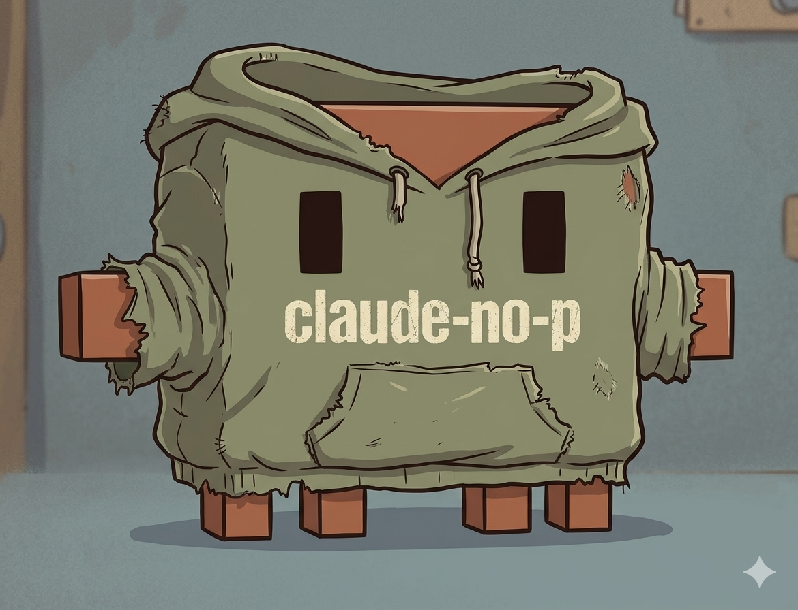

# poor-claude (`claude-no-p`)

<p align="center">
  
</p>

<p align="center">
  <a href="https://github.com/HammerMei/poor-claude/stargazers"></a>
  <a href="https://github.com/HammerMei/poor-claude/releases/latest"></a>
  <a href="https://github.com/HammerMei/poor-claude/blob/main/LICENSE"></a>
  <a href="https://www.python.org/"></a>
</p>

A drop-in replacement for `claude -p` (headless mode) that routes prompts through
**persistent interactive Claude Code sessions** instead of spawning a new subprocess
per call — keeping your usage under a Claude subscription rather than billing as API
calls.

> If this saved your wallet, a ⭐ [star](https://github.com/HammerMei/poor-claude) is free — unlike `claude -p`.

## Why

Starting June 2025, `claude -p` is billed as API usage separate from the subscription.
Interactive `claude` sessions (no `-p`) remain subscription-included. `poor-claude`
bridges the gap: it presents the same request/response interface as `claude -p`, but
under the hood it talks to a long-lived interactive session via MCP Channels and a
Stop hook.

## How it works

```
claude-no-p "your prompt"
     │
     ▼
 Daemon (HTTP)
     │   ┌─────────────────────────────────────┐
     │   │  Persistent claude session          │
     ├──►│  ┌──────────────┐  ┌─────────────┐ │
     │   │  │ MCP Channel  │  │  Stop hook  │ │
     │   │  │  (delivery)  │  │ (completion)│ │
     │   │  └──────────────┘  └─────────────┘ │
     │   └─────────────────────────────────────┘
     │
     ▼
  response text
```

- A local HTTP daemon manages one or more named sessions.
- Each session is a single long-lived `claude` process with `--dangerously-load-development-channels`.
- Prompts are delivered via an MCP Channel; the Stop hook signals completion back to the daemon.
- A PreToolUse hook enforces a deny-by-default permission policy (configurable via `--allowed-tools` / `--disallowed-tools`).

## Requirements

- Python 3.11+
- [Claude Code](https://claude.ai/code) installed and authenticated (`claude` on `PATH`)
- A Claude subscription (Max or higher recommended for heavy use)

## Installation

```bash
curl -fsSL https://raw.githubusercontent.com/HammerMei/poor-claude/main/scripts/bootstrap.sh | bash
```

This installs the package into `~/.poor-claude/venv/` and creates a
`claude-no-p` wrapper at `~/.local/bin/claude-no-p`.

```bash
# Custom install location
curl -fsSL https://raw.githubusercontent.com/HammerMei/poor-claude/main/scripts/bootstrap.sh | bash -s -- --bin-dir /usr/local/bin

# Update an existing install
curl -fsSL https://raw.githubusercontent.com/HammerMei/poor-claude/main/scripts/bootstrap.sh | bash -s -- --upgrade
```

Or clone and install locally:

```bash
git clone https://github.com/HammerMei/poor-claude.git
cd poor-claude
scripts/install.sh
```

Make sure `~/.local/bin` is on your `PATH`:

```bash
export PATH="$HOME/.local/bin:$PATH"   # add to ~/.bashrc or ~/.zshrc
```

## Quick start

```bash
# One-shot prompt (like claude -p)
claude-no-p -p "what is 2+2"

# Resume a named session
claude-no-p --resume 4b3e8f21-7a2d-4c9e-b1f6-3d0a5c2e9b87 -p "follow-up question"

# With a specific model and effort level
claude-no-p --model claude-opus-4-5 --effort high -p "write me a haiku"

# Pipe input
echo "summarise this" | claude-no-p -p

# JSON output
claude-no-p --output-format json -p "hello"
```

## Session lifecycle

Sessions are persistent by default. The first request to a session ID starts a
Claude process; subsequent requests reuse it with full conversation history.

```bash
# Explicitly pre-create a session (optional)
claude-no-p --start-session --session-id my-bot

# List active sessions
claude-no-p --sessions

# Stop a session
claude-no-p --stop-session --session-id my-bot

# Prune expired sessions
claude-no-p --prune-sessions
```

## Tool permissions

`claude-no-p` defaults to **deny all tools** in interactive sessions to prevent
permission dialogs from blocking headless use. Explicitly allow what you need:

```bash
# Allow specific bash commands
claude-no-p --allowed-tools "Bash(ls *)" --allowed-tools "Bash(git *)" "what files are here"

# Allow all bash, deny destructive commands
claude-no-p --allowed-tools "Bash" --disallowed-tools "Bash(rm *)" "run the tests"

# Bypass permission checks entirely (trusted environments only)
claude-no-p --permission-mode bypassPermissions "do anything"
```

Permission rules persist for the lifetime of the session and can be updated on any
subsequent request without restarting — the hook reads the policy file fresh on each
tool call.

## CLI reference

### Prompt

| Flag | Description |
|---|---|
| `prompt` | Positional prompt argument |
| `-p`, `--print` | Read prompt from stdin |
| `--output-format` | `text` (default), `json`, `stream-json` |
| `--timeout` | Response timeout in seconds (default: `POOR_CLAUDE_TIMEOUT_SECONDS` env var or 300) |

### Session

| Flag | Description |
|---|---|
| `--session-id UUID` | Reuse a specific session |
| `-r`, `--resume UUID` | Alias for `--session-id` |
| `--ttl DURATION` | Session TTL (e.g. `30m`, `2h`, `1d`) |
| `--keep-alive` | Session never expires |
| `--workdir PATH` | Working directory for the session |
| `--start-session` | Pre-create a session without sending a prompt |
| `--stop-session` | Stop a running session |
| `--sessions` | List all sessions |
| `--prune-sessions` | Remove expired sessions |
| `--shutdown` | Shut down the daemon |

### Model & runtime

| Flag | Description |
|---|---|
| `--model MODEL` | Model name or alias (`sonnet`, `opus`, …) |
| `--effort LEVEL` | `low`, `medium` (default), `high`, `xhigh`, `max` |
| `--system-prompt TEXT` | Replace the default system prompt |
| `--append-system-prompt TEXT` | Append to the default system prompt |
| `--tools TOOL …` | Restrict built-in tool set (repeat for multiple; `""` = disable all) |
| `--add-dir PATH` | Add a directory to Claude's tool access (repeat for multiple) |
| `--settings FILE` | Path to a Claude settings JSON file |

### Permissions

| Flag | Description |
|---|---|
| `--permission-mode MODE` | `default`, `auto`, `acceptEdits`, `dontAsk`, `bypassPermissions`, `plan` |
| `--dangerously-skip-permissions` | Alias for `--permission-mode bypassPermissions` |
| `--allowed-tools RULE` | Allow a tool rule, e.g. `Bash(ls *)` (repeat for multiple) |
| `--disallowed-tools RULE` | Deny a tool rule — takes priority over allow (repeat for multiple) |

### Misc

| Flag | Description |
|---|---|
| `--dry-run` | Print the resolved request envelope without sending |
| `--debug` | Print raw server response to stderr |
| `--json` | Use JSON output for `--sessions` / `--prune-sessions` |

## Environment variables

These can be set in your shell profile or systemd/launchd service to tune defaults without changing the command line.

| Variable | Description | Default |
|---|---|---|
| `POOR_CLAUDE_TIMEOUT_SECONDS` | Default request timeout (seconds). CLI `--timeout` takes priority. | `300` |
| `POOR_CLAUDE_TTL_SECONDS` | Default session TTL (seconds). CLI `--ttl` takes priority. | `900` (auto) / `3600` (named) |
| `POOR_CLAUDE_STATE` | Path to the daemon state file. | `~/.poor-claude/daemon.json` |
| `POOR_CLAUDE_STALL_SECONDS` | No-response watchdog (see below): if the transcript stops growing for this many seconds while a request is open, try to recover a hung Claude. `0` disables the watchdog. | `0` (disabled) |
| `POOR_CLAUDE_STALL_ACTION` | What to do on a stall: `off`, `nudge`, `restart`, or `nudge_then_restart`. Only takes effect when `POOR_CLAUDE_STALL_SECONDS > 0`. | `nudge_then_restart` |
| `POOR_CLAUDE_MAX_NUDGES` | Max nudge attempts per stall before escalating (or, in `nudge` mode, before falling through to the hard timeout). | `3` |
| `POOR_CLAUDE_MAX_RESTARTS` | Max kill+resume relaunches per request before falling through to the hard timeout/kill path. | `1` |
| `POOR_CLAUDE_NUDGE_PROMPT` | Text sent as the nudge message. | `Please continue your previous response.` |

### No-response watchdog (experimental, default off)

Claude Code can hang mid-turn waiting on an SSE stream that never delivers, at any
point in a session ([#26224](https://github.com/anthropics/claude-code/issues/26224),
[#57103](https://github.com/anthropics/claude-code/issues/57103)). It then writes
nothing more and never fires its Stop hook, so a request sits idle until the hard
timeout kills the process. The watchdog detects a stalled transcript (no byte growth
for `POOR_CLAUDE_STALL_SECONDS`, request still open, no background work in flight) and
tries to recover before the timeout. Behaviour is set by `POOR_CLAUDE_STALL_ACTION`:

- **`nudge`** — send up to `POOR_CLAUDE_MAX_NUDGES` messages; a follow-up message is
  the reported workaround for reviving a stuck SSE stream. Cheap, preserves the turn,
  but inert if Claude's loop is fully wedged.
- **`restart`** — kill the process and relaunch with `claude --resume` (conversation
  preserved), then re-inject the stuck prompt. Heavier but almost always recovers.
- **`nudge_then_restart`** (default action) — nudge first, then escalate to one
  restart if still stalled. Covers both a soft SSE stall and a hard process wedge.

The whole watchdog is **disabled by default** (`POOR_CLAUDE_STALL_SECONDS=0`) because
two things can't be verified without reproducing a real hang on your box:

1. **Nudge efficacy** — whether a channel-notification nudge actually wakes a Claude
   hung on SSE is Claude Code's internal behaviour. (Restart does not rely on this.)
2. **False positives** — stall detection keys off transcript byte growth and cannot
   distinguish a hang from a legitimately quiet **foreground** tool call (a slow
   `Bash` test/build/install). If `POOR_CLAUDE_STALL_SECONDS` is shorter than such a
   call, the watchdog acts on a healthy turn. (Background agents are already guarded.)
   Set the window **above your longest expected quiet period** and **well below the
   request timeout** (`POOR_CLAUDE_TIMEOUT_SECONDS`, default 300) — leave room for all
   the nudges *plus* a restart, roughly `stall < timeout / (MAX_NUDGES + 2)`. With the
   defaults (timeout 300, `MAX_NUDGES` 3) a 120s stall never reaches the restart: ~2
   nudges fire and the hard timeout kills at 300s first.

Note that **restart is not a "proven" path** — it just carries a *different* unverified
assumption than nudge: that a resumed Claude actually picks up the re-injected prompt
(same `request_id`) and finishes. That can only be confirmed where the hang reproduces.
(`resume_on_launch` is set once and left set, so the session's future relaunches also
resume — intended, but noted so it isn't a surprise.)

**Validation recipe:** set `POOR_CLAUDE_STALL_SECONDS` to a low value, reproduce a
hang, then check the session metadata (`nudges_sent`, `stall_restarts`, `last_nudge_at`,
`last_restart_at`) **and, crucially, confirm the request actually returned a response**
afterwards — an incremented `stall_restarts` only proves the watchdog fired, not that
recovery worked. Start with `POOR_CLAUDE_STALL_ACTION=nudge`; if nudging proves inert,
switch to `restart` (no code change — just restart the daemon). Enable on by default
only after this confirms a stalled request actually completes.

## Architecture notes

See [`docs/architecture.md`](docs/architecture.md) for a detailed description of the
daemon, session routing, hook design, and permission model.

## Development

```bash
# Install in editable mode
pip install -e .

# Run tests
python -m pytest tests/ -q
```

## License

MIT — see [LICENSE](LICENSE).
